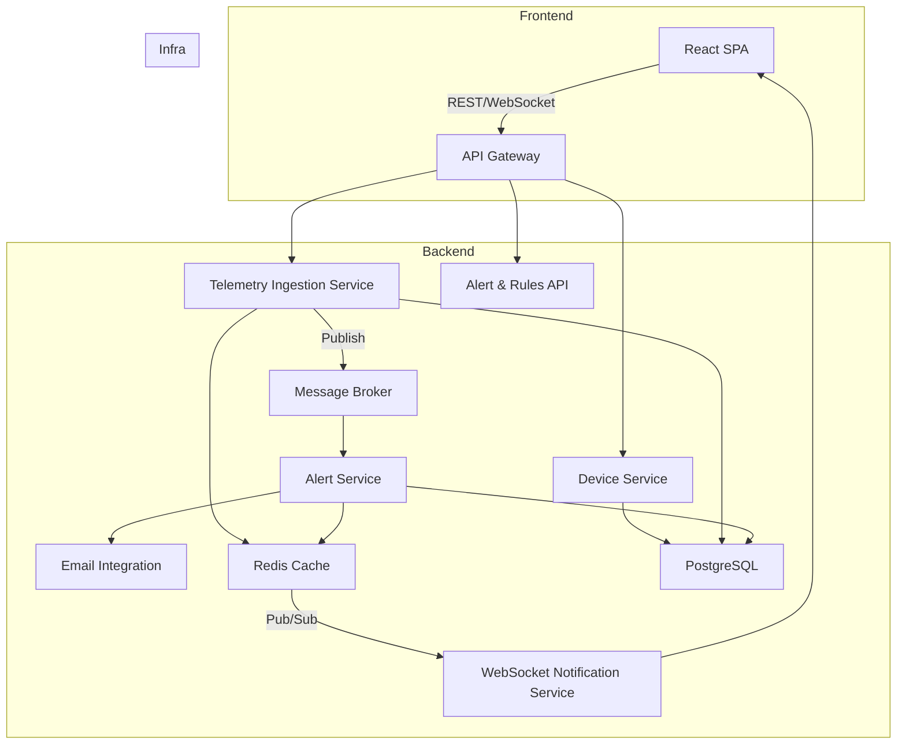

# Architect Mission Report

**Agent**: architect  
**Generated**: 2026-08-08T19:50:06.902Z

---

## Architecture Style

Modular Monolith (service‑oriented) deployed as independent containers

## Components

- **React SPA** (Frontend UI): Single‑page application used by operators to view maps, tables, device details and configure alerts.
- **API Gateway** (Edge / Routing): Single entry point for all HTTP traffic; handles request routing, rate limiting, and API‑key authentication.
- **Device Service** (Domain Service): CRUD operations for device registration, metadata updates, and deactivation. Persists to PostgreSQL.
- **Telemetry Ingestion Service** (Ingestion Service): Validates incoming telemetry, writes raw points to PostgreSQL, updates latest state in Redis, and publishes events to the message broker.
- **Alert Service** (Rule Engine & Alert Store): Consumes telemetry events, evaluates operator‑defined rules, creates alert records, pushes notifications, and triggers email integration.
- **Alert & Rules API** (Domain API): CRUD for alert rules, query active alerts, and manual acknowledgment.
- **WebSocket Notification Service** (Realtime Push): Subscribes to Redis Pub/Sub channels and pushes state changes to connected UI clients via WebSocket.
- **Message Broker** (Asynchronous Messaging): Decouples telemetry ingestion from alert evaluation; buffers burst traffic.
- **Redis Cache** (In‑memory Store): Holds latest device state for fast UI queries and provides Pub/Sub for realtime updates.
- **PostgreSQL** (Relational Database): Primary persistence for device records, telemetry history, alert definitions, and audit logs.
- **Email Integration** (External Integration): Sends email notifications when alerts fire; currently logs to console for dev.

## Tech Stack

- **Frontend**: React + TypeScript (Vite build) — React has the largest talent pool and ecosystem for SPA dashboards; Vite gives fast dev cycles. Angular adds unnecessary boilerplate for this UI, Vue is viable but React's component library ecosystem (e.g., Ant Design) accelerates map/table development.
- **API Gateway**: AWS API Gateway (managed) or self‑hosted Kong — Managed API Gateway removes ops overhead and provides built‑in throttling and API‑key support. Kong offers similar features on‑premise; NGINX requires custom auth code, and Traefik lacks native API‑key management.
- **Device Service**: Node.js with NestJS (REST) — NestJS gives a modular, opinionated structure similar to Spring but with JavaScript/TypeScript, matching the frontend skill set. Spring adds JVM overhead and longer startup; Django is solid but would split language stacks.
- **Telemetry Ingestion Service**: Python FastAPI — FastAPI provides async handling, automatic validation via Pydantic, and excellent performance for I/O‑bound ingestion. Node would duplicate language with Device Service but FastAPI is more concise for data validation; Go is fast but adds a second compiled language for a small team.
- **Alert Service**: Node.js with NestJS — Reusing NestJS reduces context switching; its module system fits rule‑engine logic. Celery introduces a separate worker process model; Quarkus is heavyweight for a modest rule engine.
- **Message Broker**: RabbitMQ — RabbitMQ offers reliable queues with low latency and easy Pub/Sub for a few thousand devices. Kafka is overkill for this scale and adds operational complexity; SQS lacks true Pub/Sub and ordering guarantees needed for rule evaluation.
- **Cache / PubSub**: Redis — Redis provides both key‑value caching and Pub/Sub needed for realtime UI updates. Memcached lacks Pub/Sub; managed Redis is an ops option but the self‑hosted version is sufficient for early V1.
- **Database**: PostgreSQL 15 — PostgreSQL offers strong relational modeling for devices, telemetry (time‑series extensions optional), and ACID guarantees for audit logs. MySQL is comparable but PostgreSQL’s JSONB and extensions give flexibility; MongoDB would complicate joins and transactional consistency.
- **Authentication / API Keys**: API‑Key validation in API Gateway (custom Lambda authorizer) — For the first version a simple API‑key model is sufficient and easy to manage per‑customer. OAuth adds unnecessary token exchange flow; Auth0 introduces external dependency and cost.
- **Email Integration**: SendGrid SMTP wrapper — SendGrid has a generous free tier and simple SMTP interface; SES is AWS‑centric but requires additional IAM setup; Mailgun is comparable but SendGrid’s SDK is more straightforward for logging‑only stub.
- **CI/CD**: GitHub Actions with Docker build & push to ECR — GitHub Actions integrates natively with the repo, provides matrix builds, and is free for public/private small teams. GitLab CI is similar but adds another platform; Jenkins requires self‑hosted agents.
- **Testing**: Jest (unit) + Cypress (e2e) for frontend, pytest for Python services, supertest for Node services — Jest is the de‑facto standard for React/TS testing; Cypress gives reliable UI e2e tests. Pytest is mature for Python; Supertest works well with NestJS. Mocha is older, Playwright overlaps with Cypress.
- **Observability**: OpenTelemetry SDKs → Prometheus (metrics) + Loki (logs) + Jaeger (traces) — OpenTelemetry is vendor‑neutral and integrates with all chosen runtimes; Prometheus/Loki/Jaeger are open source and cost‑effective. SaaS solutions add recurring cost and lock‑in.
- **Container Runtime / Orchestration**: Docker Compose for local dev, Docker containers on ECS Fargate for production — The target scale (few thousand devices) does not justify full Kubernetes; ECS Fargate provides managed scaling without cluster ops. Docker Swarm is deprecated; Kubernetes adds unnecessary complexity.

## Epics

- **E1** Device Management: Enable operators to register, update, deactivate, and view devices; expose CRUD via UI and API.
- **E2** Telemetry Ingestion Pipeline: Collect, validate, store, and broadcast telemetry from devices in near real‑time.
- **E3** Real‑Time Fleet Dashboard: Map view and tabular list that auto‑refreshes within seconds, supporting filters and pagination.
- **E4** Device Detail & Historical View: Show last 24 h telemetry charts, alerts, static info, and allow operators to add notes.
- **E5** Alerting & Rule Engine: Allow operators to define threshold‑based rules, evaluate them in real‑time, record alerts, and send optional email notifications.
- **E6** External REST API: Provide authenticated endpoints for listing devices, fetching telemetry history, and querying active alerts for downstream systems.
- **E7** Audit Logging: Record who performed configuration changes (device metadata, alert rules) with timestamps for compliance.
- **E8** CI/CD Pipeline & Deployment: Automate building, testing, container image creation, and deployment to staging/production environments.

## Architecture Diagram

