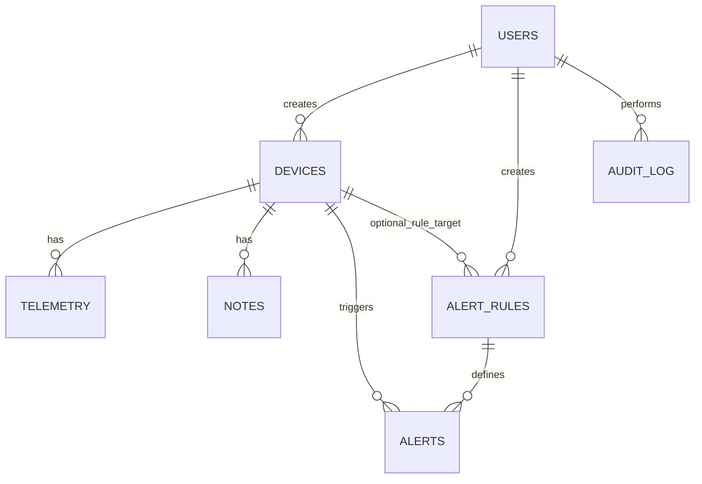

# DBA Mission Report

**Agent**: dba  
**Generated**: 2026-08-08T19:51:13.630Z

---

## Database Engine: PostgreSQL 15

PostgreSQL provides strong relational modeling, ACID guarantees for audit logs, rich JSONB support for flexible telemetry payloads, native UUID generation, and extensions for time‑series indexing. It aligns with the tech stack decision and supports the required scalability and reliability features.

## Entities (7)

- **users**: 6 columns
- **devices**: 8 columns
- **telemetry**: 5 columns
- **notes**: 6 columns
- **alert_rules**: 9 columns
- **alerts**: 8 columns
- **audit_log**: 8 columns

## ERD

